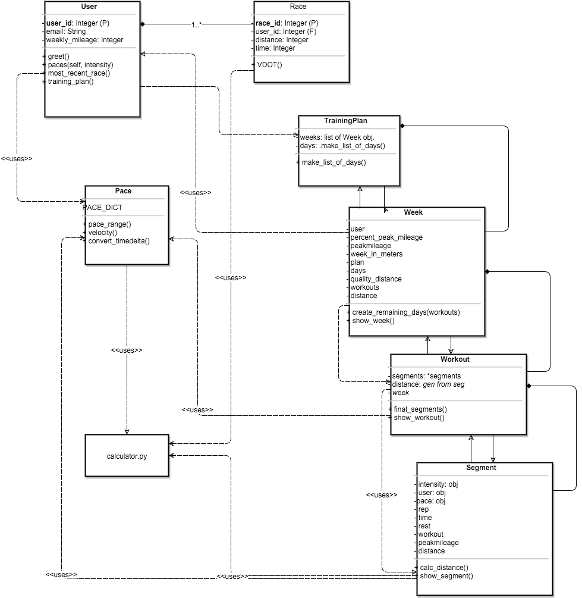
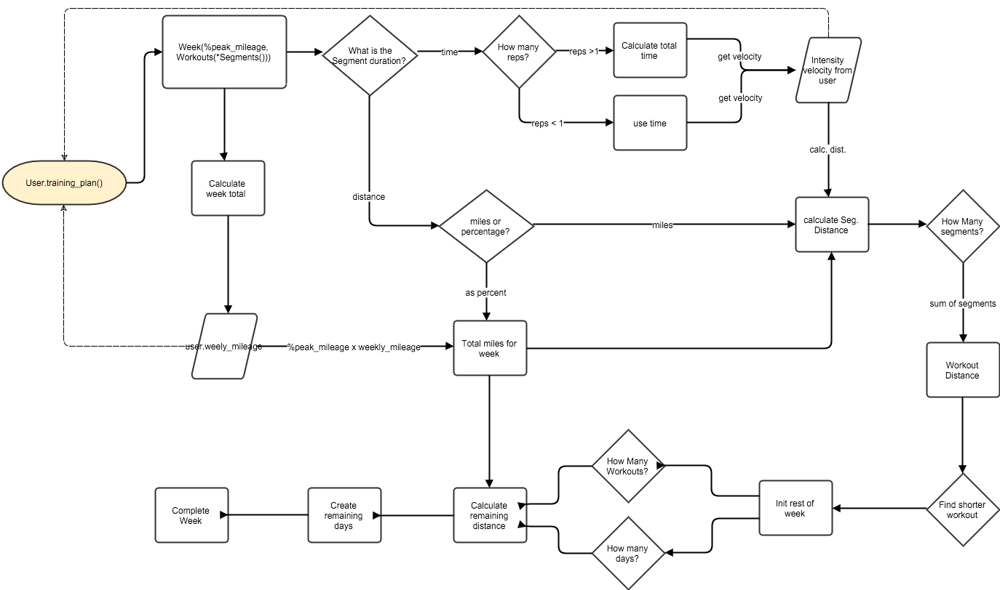

==================
Fast As You Can
==================

Overview
--------

As Fast As You Can is an individualized 18-week marathon training plan based on Jack Daniels' Running Formula and an earlier paper, `Oxygen Power <http://s3.amazonaws.com/zanran_storage/www.canibaisereis.com/ContentPages/2466959967.pdf.>`_ by Jack Daniels and Jimmy Glibert. This project was chosen as an exercise in object oriented design and data modeling.

JD uses the relationships between running velocity/VO2 demand, and running duration and the fraction of VO2max in his training design. 

Here are examples of JD's tables: 

.. image:: http://www.coacheseducation.com/images/vdot1.jpg

This first table assigns runners who have preformed similarly, (aerobically) in various races to a training group, or VDOT value. 

.. image:: http://www.coacheseducation.com/images/vdot3.jpg

In this second table different intensities of training (easy, marathon, threshold/tempo...) are given for specific VDOT values. 

I chose this project as an exercise in OOD and data modeling.
Once you can describe a user based on their aerobic capacity you know several things about them -

- how fast they will be traveling at any given intensity 
- if running for time, how far they will travel
- if running for distance, how long it will take them

Because you can now approximate speed for all users based on simple rules it becomes easier to generate simple instructions. 

From here I wanted to abstract the idea of a training plan and encapsulate the components of a training plan from the most basic level up to the level of having a full training cycle. In this specific case taking a person with low to moderate running experience and giving them the training to complete a marathon. 

Digging down to the most basic level, a set of instructions for running will be defined by an intensity and a duration. I called this a segment.

**segment**
     most basic component of a training plan, describes a pace for a duration which can be either distance or time based. 

As for the component pieces of a segment, JD gives us a nice platform to define intensity. 

**intensity**
    a percentage of VDOT that can be translated to a velocity:
         - Easy - 55-74% VDOT
         - Marathon - 75-84% VDOT
         - Tempo - 83-89% VDOT

Duration however, may take many forms - time, miles, percentage of the week. 
If durations are not absolute (in miles or kilometers) the distance still must be calculated, the segment class contains methods to determine distance using the intensity and the duration. 

Once you have the idea of a segment you may combine them to make specific workouts. 

**workout**
     a unit of training composed of segments, can be seen as a day

And workouts can be combined to make a week 

**week**
     composed of workouts, total distance is a percentage of the user defined max

The program is designed to take a variable number of days, any days remaining from a weekly total of seven will return as 'rest days'. 

Workouts can be explicitly described, by segments. Any remaining days from the variable days will be generated by the week. 

The lesser of two workouts given a user can be selected for by passing the two workouts as a tuple into the week. 

Here is a diagram of the model

Here is a diagram for the generation of a week. 

